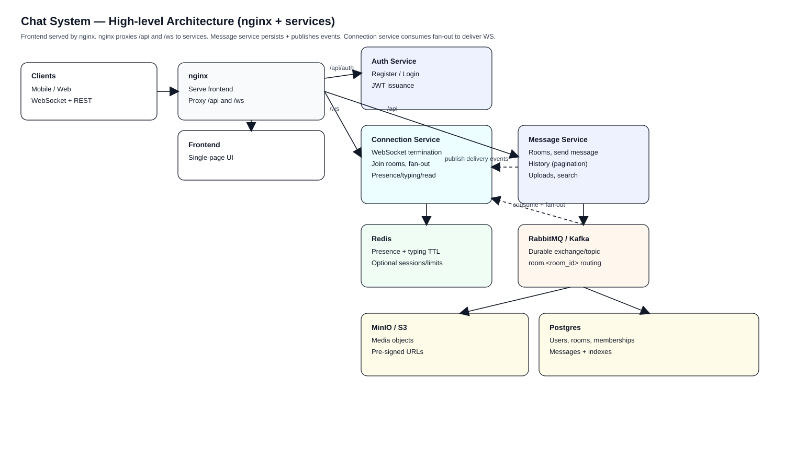

# Task 4 — Chat System (System Design)

Design a scalable chat system (Telegram/WhatsApp-like). Coding is optional (bonus). This README focuses on system design, tradeoffs, and scalability.

## Bonus (completed): runnable demo

There is a minimal working implementation in this folder:
- `docker-compose.yml` runs: `nginx`, `auth`, `message`, `connection`, `postgres`, `redis`, `rabbitmq`
- Frontend is served on `http://localhost/`

Demo scope (minimal):
- one room: `general`
- no uploads, typing indicators, or read receipts

Run (from this folder):

```bash
docker compose up --build
```

Stop:

```bash
docker compose down
```

Open:
- UI: http://localhost/
- RabbitMQ UI: http://localhost:15672 (guest/guest)

Quick test:
1. Register + login as `alice`.
2. Open incognito, register + login as `bob`.
3. Send messages in room **General** and see them in real time.

## Requirements

### Functional
- 1:1 chat and group chat
- Real-time message delivery
- Message history (pagination)
- Online presence + typing indicators (optional but common)
- Read receipts (optional)
- Media attachments (images/files)

### Non-functional
- High availability
- Low latency for real-time delivery
- Scalability (millions of users)
- Fault tolerance
- Eventual consistency is acceptable for presence/typing

## 1. System Overview

A production chat system is typically split into:
- **REST APIs** for auth, room management, and fetching history.
- **WebSocket layer** for real-time delivery.
- **Message persistence** in a DB.
- **Fan-out** (MQ/stream) so multiple WebSocket nodes can deliver the same message to online users.

Core idea:
- Write path is durable (store message first).
- Real-time delivery is best-effort (users might be offline).
- Clients always can fetch missing messages from history.

## 1.1 Services (reference architecture)

This matches the “many files” example you showed (dockerized demo architecture):
- **nginx**: serves the frontend and proxies `/api` and `/ws`
- **auth service**: register/login, issues JWT
- **message service**: rooms, history, message persistence, uploads, publishes delivery events
- **connection service**: WebSocket auth + join, presence/typing/read receipts, consumes MQ and fan-outs to connected clients
- **postgres**: users, rooms, memberships, messages
- **redis**: presence + typing TTL, optional rate limits / session cache
- **rabbitmq (or kafka)**: async fan-out events between message and connection services
- **minio (or S3)**: media storage

## 2. Architecture Diagram

Diagram:




## 3. API Design (REST)

### Auth
- `POST /api/auth/register`
- `POST /api/auth/login`

Example: `POST /api/auth/login`
```json
{ "username": "alice", "password": "password123" }
```
Response:
```json
{ "token": "<jwt>", "userId": "u_123" }
```

### Rooms
- `GET /api/rooms` — list rooms
- `POST /api/rooms` — create room

`POST /api/rooms` request:
```json
{ "name": "General", "memberIds": ["u_123", "u_456"] }
```

### Send message
- `POST /api/messages`

Request:
```json
{
  "roomId": "r_1",
  "idempotencyKey": "clientMsg-abc-001",
  "content": "Hello!",
  "attachments": []
}
```

Response (server message id):
```json
{ "messageId": "m_999", "status": "stored" }
```

### Fetch history
- `GET /api/rooms/{roomId}/messages?limit=50&before=<messageId>`

Response:
```json
{
  "items": [
    {
      "id": "m_999",
      "roomId": "r_1",
      "senderId": "u_123",
      "content": "Hello!",
      "createdAt": "2026-04-30T10:00:00Z"
    }
  ],
  "nextBefore": "m_888"
}
```

### Upload (attachments)
Two common options:
1) **Pre-signed URL** (preferred at scale): client uploads directly to object storage.
2) Upload via API (simpler but stresses app servers).

Endpoint (pre-signed URL): `POST /api/uploads/presign`
```json
{ "fileName": "pic.png", "contentType": "image/png", "sizeBytes": 123456 }
```
Response:
```json
{ "uploadUrl": "https://...", "objectKey": "uploads/u_123/..." }
```

## 4. WebSocket Events

### Client → Server
```json
{ "type": "auth", "token": "<jwt>" }
```
```json
{ "type": "join", "roomId": "r_1" }
```
```json
{ "type": "message", "roomId": "r_1", "clientMsgId": "clientMsg-abc-001", "content": "Hello" }
```
```json
{ "type": "typing", "roomId": "r_1", "isTyping": true }
```
```json
{ "type": "read", "roomId": "r_1", "messageId": "m_999" }
```

### Server → Client
```json
{ "type": "message", "id": "m_999", "roomId": "r_1", "senderId": "u_123", "content": "Hello", "createdAt": "<iso>" }
```
```json
{ "type": "typing", "roomId": "r_1", "userId": "u_123", "isTyping": true }
```
```json
{ "type": "presence", "userId": "u_123", "status": "online" }
```
```json
{ "type": "read", "roomId": "r_1", "userId": "u_456", "messageId": "m_999", "status": "read" }
```

## 5. Data Model

A relational schema (Postgres) is common for correctness and querying. At very large scale, messages often move to wide-column NoSQL.

### Tables

**users**
- `id` (PK)
- `username` (unique)
- `password_hash`
- `created_at`

**rooms**
- `id` (PK)
- `type` (`dm` | `group`)
- `name` (nullable)
- `created_at`

**memberships**
- `room_id` (PK part)
- `user_id` (PK part)
- `role`
- Index: `(user_id)` to list user rooms quickly

**messages**
- `id` (PK)
- `room_id` (index)
- `sender_id`
- `content`
- `created_at`
- `client_msg_id` + `sender_id` unique (idempotency)
- Composite index for paging: `(room_id, created_at, id)`

**message_receipts** (optional)
- `room_id`, `user_id`, `last_read_message_id`, `updated_at`

### Redis keys (ephemeral)
- `presence:{user_id}` → `online/offline` (TTL)
- `typing:{room_id}:{user_id}` → `1` (TTL 3–5s)

## 6. Scaling Strategy

### WebSocket scaling
- **Sticky sessions** at LB, or a dedicated WS gateway.
- Multiple Connection Service instances.
- Use MQ/stream for cross-node fan-out so recipients connected to another node still get messages.

### Database scaling
- Start with Postgres (partition by `room_id` or by time as data grows).
- For huge scale: move `messages` to Cassandra/Dynamo (partition key = `room_id`, clustering = `created_at`).

### Caching
- Redis for hot metadata (room members, user profiles, presence).

### Backpressure
- If MQ backlog grows, scale consumers.
- If DB is slow, message service can shed load (429/503) instead of cascading failure.

## 7. Reliability & Failures

- **At-least-once delivery** for real-time events; duplicates possible.
- **Idempotency**: client includes `clientMsgId`; server enforces uniqueness per sender.
- If real-time delivery fails, history fetch repairs gaps.
- Retries for MQ publishes and transient DB failures.
- DLQ for poison messages/events.

## 8. Tradeoffs

1) **WebSocket vs Long polling**
- WebSocket: best latency, but harder to scale (connections, state).
- Long polling: simpler infra, higher latency and more requests.

2) **SQL vs NoSQL for messages**
- SQL: strong constraints, flexible queries.
- NoSQL: horizontal scale for massive message volume, but more complexity.

3) **Fan-out on write vs fan-out on read**
- Fan-out on write: fast reads, expensive writes (large groups).
- Fan-out on read: cheaper writes, more work on reads.

---

Done by: <YOUR NAME HERE>
